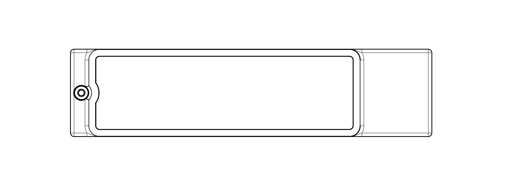

# Extrodrive

Casing for turning an NVMe M.2 2280 SSD into an external one, supporting USB 3.2 and transfers up to 1.25 GB/s.

## Manufacturing

## Assembling

Lay the top casing upside down and insert the heat sink into the slot. Apply the thermal pad roughly to the center of the heat sink.

Separate from the previous assembly, insert the SSD into the PH80-583S.

Flip the second assembly upside down and place it inside the previously assembled assembly, with the top casing still also upside down.

